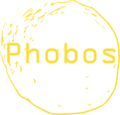
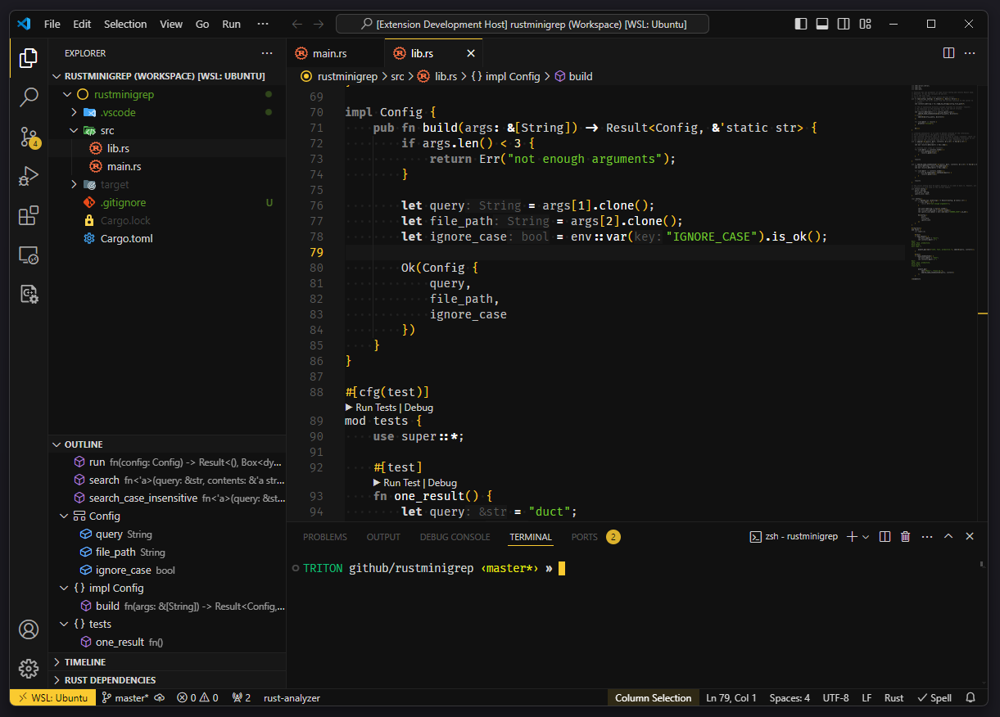

# Phobos - A dark theme for Visual Studio Code




*Phobos*, one of two moons of Mars, is the namesake and inspiration for this
expansion.

The signature color is **zinc yellow** `#FACA30` (RAL 1018).

## Screenshot



## Recommended Setup

```json
"editor.fontFamily": "'Fira Code'",
"editor.cursorStyle": "block",
"editor.bracketPairColorization.enabled": false,
```

Get *Fira Code* font: <https://github.com/tonsky/FiraCode>

## Syntax Highlighting

Minimal but supportive syntax highlighting.

Tested with:

- [x] C
- [ ] C#
- [ ] C++
- [x] CSS
- [x] HTML
- [x] JSON
- [x] makefile
- [x] Markdown
- [x] Python
- [x] Rust
- [x] TOML
- [ ] XML
- [ ] YML
- [ ] ... (to be continued)

## Development

This theme is still in early stage of development!

Elements that need to be checked have a bright pink color: #FA00AF. I did not
manage to make them visible during the tests. Some of these elements may be
obsolete.

### To do

- [ ] Check the unknown elements
- [ ] Define colors for:
  - [ ] chat.*
  - [ ] inlineChat.*
  - [ ] interactive.*
- [ ] Test and improve syntax highlighting

### Links

- <https://encycolorpedia.de/faca30>
- <https://code.visualstudio.com/api/references/theme-color>
- <https://code.visualstudio.com/api/working-with-extensions/publishing-extension>
